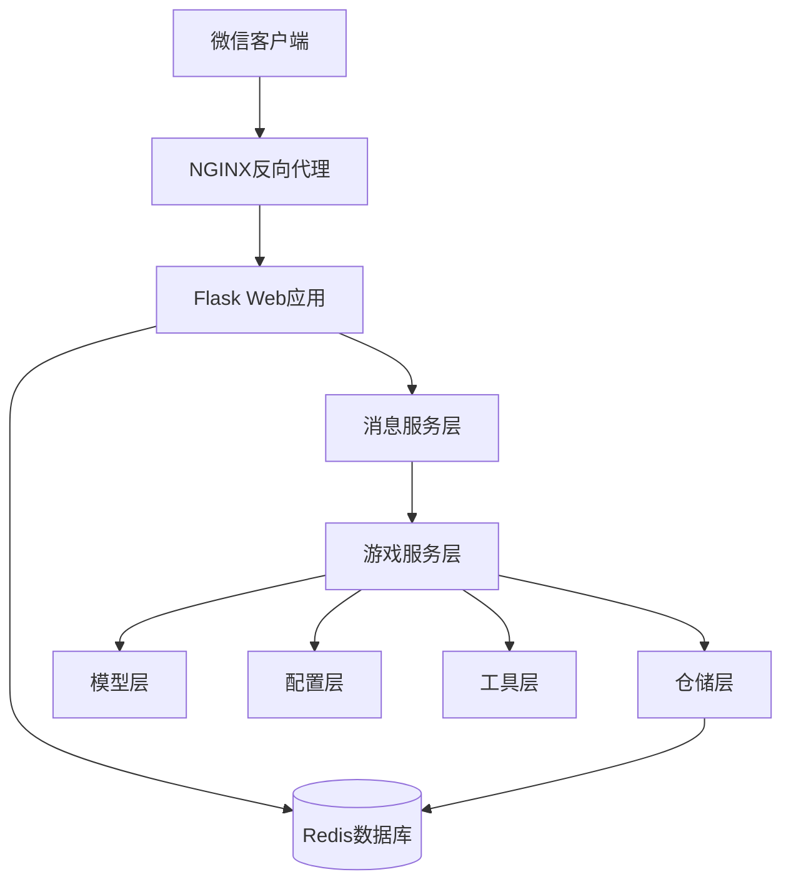
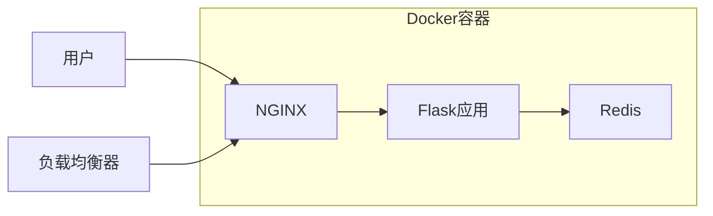

# 谁是卧底游戏架构设计

## 项目概述

本项目是一个基于微信公众号的"谁是卧底"文字游戏，采用现代化的软件架构设计，遵循面向对象编程原则和设计模式，具有良好的可维护性和扩展性。

## 架构设计

### 整体架构图



### 分层架构

#### 1. 表示层 (Presentation Layer)
- **组件**：Flask Web应用、NGINX反向代理
- **职责**：
  - 处理HTTP请求和响应
  - 微信消息验证和解析
  - 路由分发

#### 2. 应用层 (Application Layer)
- **组件**：消息服务、游戏服务
- **职责**：
  - 业务逻辑处理
  - 用例协调
  - 事务管理

#### 3. 领域层 (Domain Layer)
- **组件**：房间模型、用户模型
- **职责**：
  - 业务实体定义
  - 业务规则实现
  - 领域逻辑封装

#### 4. 基础设施层 (Infrastructure Layer)
- **组件**：仓储层、工具层、配置层
- **职责**：
  - 数据持久化
  - 外部服务集成
  - 配置管理

## 设计模式应用

### 1. 工厂模式 (Factory Pattern)
- **应用**：`AppFactory` 类负责创建和配置Flask应用
- **优势**：解耦应用创建过程，便于测试和配置管理

### 2. 仓储模式 (Repository Pattern)
- **应用**：`RoomRepository` 和 `UserRepository` 负责数据访问
- **优势**：抽象数据访问逻辑，便于更换存储方案

### 3. 服务模式 (Service Pattern)
- **应用**：`GameService` 和 `MessageService` 封装业务逻辑
- **优势**：分离关注点，提高代码复用性

### 4. 配置模式 (Configuration Pattern)
- **应用**：`GameConfig` 类集中管理游戏配置
- **优势**：统一配置管理，便于调整和维护

## 目录结构

```
src/
├── app_factory.py          # 应用工厂
├── main.py                # 主应用入口
├── models/                # 模型层
│   ├── room.py           # 房间模型
│   └── user.py           # 用户模型
├── services/              # 服务层
│   ├── game_service.py   # 游戏服务
│   └── message_service.py # 消息服务
├── repositories/          # 仓储层
│   ├── room_repository.py # 房间仓储
│   └── user_repository.py # 用户仓储
├── config/                # 配置层
│   └── game_config.py    # 游戏配置
└── utils/                 # 工具层
    └── word_generator.py # 词语生成器
```

## 核心组件说明

### 1. 模型层 (Models)
- **Room**：房间实体，包含房间状态、玩家列表、游戏数据等
- **User**：用户实体，包含用户信息、房间关联等

### 2. 服务层 (Services)
- **GameService**：核心游戏逻辑，包括房间管理、游戏控制、投票等
- **MessageService**：微信消息处理，包括签名验证、消息解析、响应构建

### 3. 仓储层 (Repositories)
- **RoomRepository**：房间数据访问，负责房间的增删改查
- **UserRepository**：用户数据访问，负责用户的增删改查

### 4. 配置层 (Config)
- **GameConfig**：游戏配置，包括规则参数、词语库等

### 5. 工具层 (Utils)
- **WordGenerator**：词语生成器，负责随机选择词语对

## 数据流说明

1. **用户发起请求** → 微信服务器 → NGINX反向代理 → Flask应用
2. **消息服务**解析微信消息，识别用户意图
3. **游戏服务**根据用户意图调用相应业务逻辑
4. **仓储层**负责与Redis交互，持久化数据
5. **消息服务**构建响应消息，返回给用户

## 扩展性设计

### 1. 插件化词语库
- 通过配置文件管理词语库
- 支持动态添加/删除词语对

### 2. 可配置游戏规则
- 房间超时时间可配置
- 玩家数量规则可调整
- 卧底分配策略可扩展

### 3. 模块化架构
- 各层之间松耦合
- 便于替换和升级组件
- 支持微服务拆分

## 性能优化

### 1. Redis过期策略
- 利用Redis原生过期机制自动清理超时房间
- 减少手动清理开销

### 2. 连接池管理
- Redis连接复用
- 减少连接建立开销

### 3. 缓存策略
- 热点数据缓存
- 减少重复计算

## 安全设计

### 1. 微信签名验证
- 确保消息来源合法性
- 防止恶意请求

### 2. 数据隔离
- 用户数据相互隔离
- 房间数据独立管理

### 3. 输入验证
- 严格验证用户输入
- 防止注入攻击

## 测试策略

### 1. 单元测试
- 覆盖各层核心逻辑
- 使用Mock隔离外部依赖

### 2. 集成测试
- 验证组件协同工作
- 测试完整业务流程

### 3. 端到端测试
- 模拟真实用户场景
- 验证系统整体功能

## 部署架构



## 监控和日志

### 1. 健康检查
- `/health` 接口监控应用状态
- Redis连接状态检查

### 2. 日志记录
- 关键操作日志记录
- 异常信息追踪
- 性能指标收集

## 未来扩展方向

### 1. 功能扩展
- 支持多轮游戏
- 增加游戏统计
- 实现排行榜功能

### 2. 技术升级
- 微服务架构拆分
- 消息队列异步处理
- 数据库读写分离

### 3. 性能优化
- 数据库索引优化
- 缓存策略优化
- CDN加速静态资源