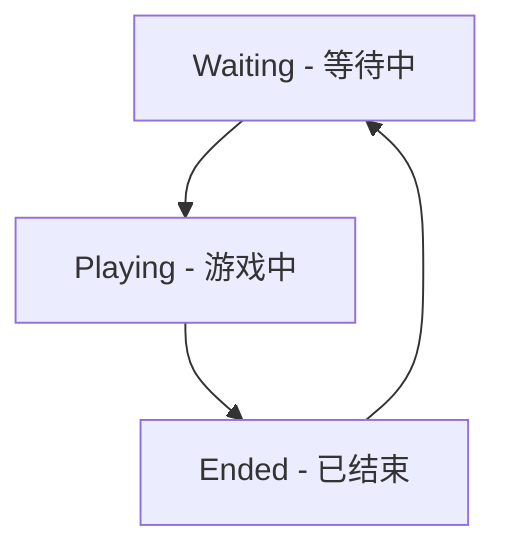
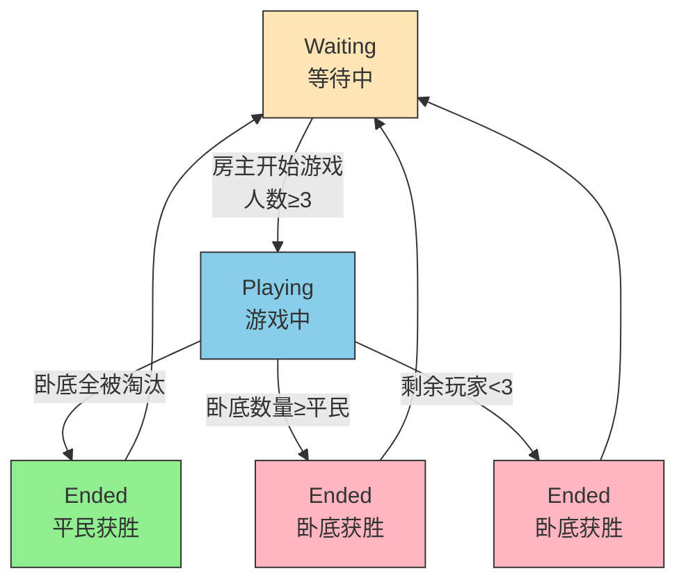

# 谁是卧底游戏状态机

## 状态定义

## 状态转换说明

### 1. Waiting (等待中)
- **初始状态**：房间刚创建或游戏结束后重置
- **允许的操作**：
  - 玩家加入房间
  - 房主开始游戏（需满足最少3人条件）
- **转换条件**：
  - 房主输入"开始游戏"且房间人数≥3 → 转换到 Playing 状态

### 2. Playing (游戏中)
- **活动状态**：游戏正在进行
- **允许的操作**：
  - 查看状态
  - 查看词语
  - 房主投票淘汰玩家
- **转换条件**：
  - 满足游戏结束条件 → 转换到 Ended 状态

### 3. Ended (已结束)
- **终止状态**：游戏结束
- **允许的操作**：
  - 查看最终结果
  - 玩家自动退出房间
- **转换条件**：
  - 系统重置房间 → 转换到 Waiting 状态

## 详细状态转换图

## 游戏结束条件

1. **平民获胜**：所有卧底都被淘汰
2. **卧底获胜**：
   - 卧底数量 ≥ 平民数量
   - 剩余玩家少于3人

## 状态相关操作限制

| 状态 | 允许的操作 | 禁止的操作 |
|------|------------|------------|
| Waiting | 创建房间、加入房间、开始游戏 | 查看词语、投票 |
| Playing | 查看状态、查看词语、投票 | 加入房间、开始游戏 |
| Ended | 查看结果 | 所有游戏操作 |

## 异常状态处理

1. **房间超时**：超过2小时未活跃的房间自动清理
2. **玩家离线**：玩家长时间不操作不影响游戏进行
3. **网络异常**：消息发送失败时记录日志但不影响游戏逻辑